# CPOFlow 화면 개선 안내 — 클라이언트 설명 자료

**작성일**: 2026년 4월 24일
**작성**: CPOFlow 개발팀
**대상**: AtoZ2010 Inc. 조달/발주 실무자

---

## 이 문서가 말하려는 것

지금 사용하시는 **CPOFlow 오더 상세 화면(드로어)**을 어떻게 바꿨는지, 바꾼 이유가 무엇인지, 그리고 **바뀐 결과가 왜 더 일하기 편한지**를 실제 화면과 함께 쉽게 설명드립니다.

**한 줄 요약**: 기존에 있던 정보는 하나도 없애지 않았습니다. 대신 **중요한 정보는 맨 위로, 안 중요한 건 뒤로, 값이 없는 칸은 잠깐 숨김**으로 정리해서 **한 눈에 업무 상황을 파악하고 다음에 할 일을 바로 누를 수 있게** 했습니다.

---

## 목차

1. 첫 화면 — 로그인
2. 대시보드 — 오늘 내가 할 일
3. 칸반 — 9단계 발주 현황 한눈에
4. 오더 상세 (드로어) — 이번 개선의 핵심
5. 오더 상세 — 6개 탭 구성
6. 받은편지함 — Gmail 자동 수집
7. 경영 리포트 — 숫자로 보는 실적
8. 발주처·거래처 관리
9. 발주 목록 전체 검색
10. 일정(캘린더) — 납기 한눈에
11. 개선 전·후 요약
12. 클라이언트 동의 요청

---

## 1. 첫 화면 — 로그인

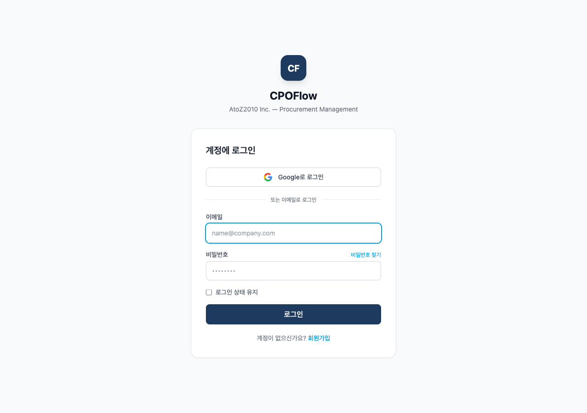

**좋아진 점**
- 이메일/비밀번호 뿐 아니라 **Google 계정으로 한 번에 로그인** 가능
- 로그인 후 자신의 브랜치(Abu Dhabi/Seoul)에 맞는 데이터만 보이도록 자동 분리

---

## 2. 대시보드 — 오늘 내가 할 일을 먼저 보여줍니다

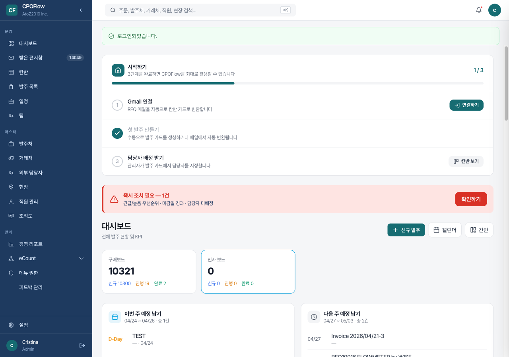

**좋아진 점**

1. **"시작하기" 3단계 가이드** — 신규 직원이 로그인하면 Gmail 연결 → 첫 발주 등록 → 담당자 배정 순서를 친절히 알려줍니다. 이미 다 한 단계는 체크(✅)로 표시되어 무엇만 더 하면 되는지 바로 보입니다.

2. **빨간색 "즉시 조치 필요" 경고 박스** — 긴급/높음 오더 + 마감일 경과 + 담당자 미배정인 오더가 몇 건인지 **한 줄로** 알려줍니다. "1건 있어요, 지금 확인하기" 버튼 한 번으로 해당 오더로 이동.

3. **보드별 요약 카드** — "구매보드 10,321건 / 인사보드 0건" 처럼 **부서별 일감이 얼마나 쌓였는지** 숫자로 보여줍니다.

4. **이번 주 / 다음 주 예정 납기** — 가장 급한 것부터 캘린더 없이도 보입니다.

---

## 3. 칸반 — 9단계 발주 흐름을 한 장의 지도로

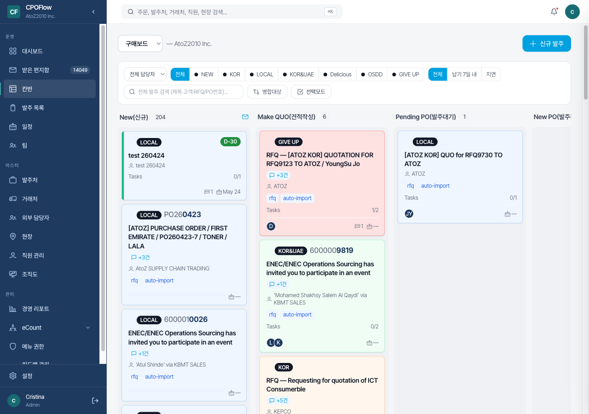

### 9개 단계의 의미
```
New(신규) → Make QUO(견적작성) → Pending PO(발주대기) → New PO(발주확정)
→ Delivery Items(납품진행) → Get GRN(수령확인) → Done(완료)
   
                                               ↓ 문제 발생 시
                                            Problem(문제)

  어느 단계든 포기 가능: Give Up(포기) ←→ New(재개)
```

**좋아진 점**

1. **상단 필터 바** — 전체 담당자 / 팀(NEW/KOR/LOCAL 등) / 긴급도 / 납기 7일내 / 지연만 보기 — 원하는 오더만 빠르게 추려내기.

2. **카드에 핵심만 4줄** — 색깔 배지(LOCAL/KOR/KOR&UAE) / 관리번호 / 고객명 / 담당자 아바타. 마우스 올리면 더 자세한 정보를 **미니 미리보기**로 보여줍니다.

3. **카드 좌측 액션 버튼** — 카드 안 열고도 "→ 다음 단계" 이동, "← 이전 단계"로 되돌리기가 클릭 한 번.

4. **컬럼별 건수 배지** — 각 단계에 몇 건 있는지 숫자로 크게 표시.

5. **D-Day 배지** — "D-30" / "D-5" / "OVERDUE 38d" 처럼 **남은 날짜가 자동으로 계산되어 붉은색/노란색**으로 경고.

---

## 4. 오더 상세 화면 (드로어) — 이번 개선의 핵심

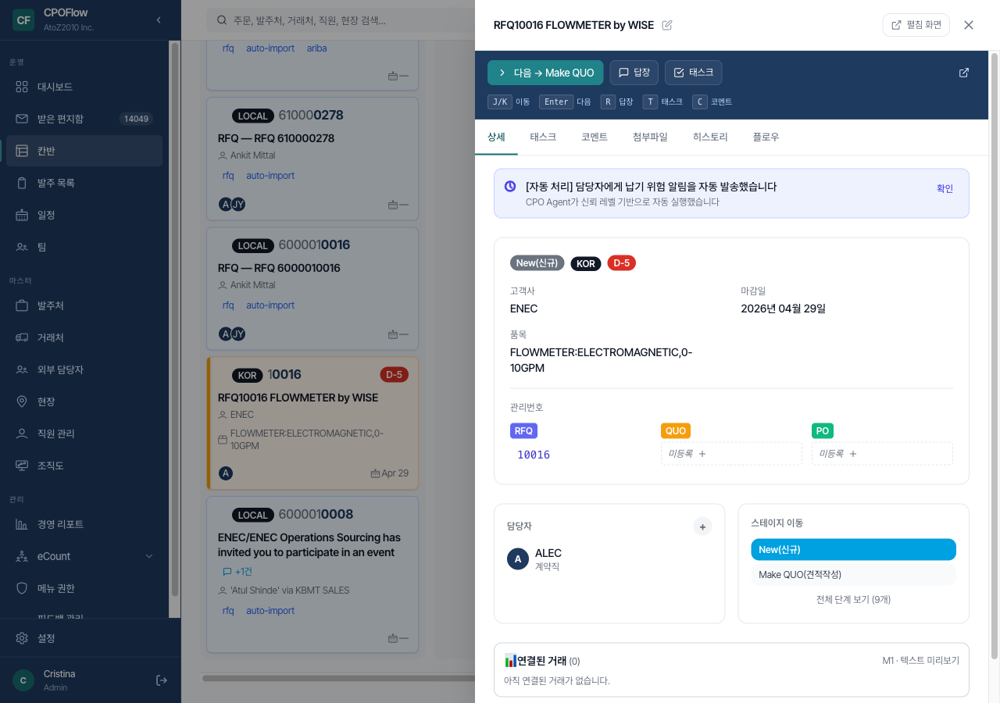

위 화면은 **RFQ10016 FLOWMETER by WISE**라는 실제 오더를 연 모습입니다. 달라진 점을 하나씩 설명드립니다.

> 📝 스크린샷의 `J/K 이동` 배지는 **차기 배포에서 제거 예정**입니다 (해당 기능 다음 배포 사이클로 연기). 배포 후 최신 화면은 `Enter · R · T · C` 4개 단축키만 노출됩니다.

### 4-1. 화면 맨 위 — "다음에 할 일"이 제일 먼저 보입니다

- **녹색 "다음 → Make QUO" 버튼** — 지금 이 오더를 다음 단계로 넘기는 가장 자주 쓰는 행동을 화면 제일 잘 보이는 곳에 배치. 클릭 한 번이면 상태 이동.
- **"답장" 버튼** — 이메일로 들어온 RFQ에 즉시 회신
- **"태스크" 버튼** — 해야 할 일 체크리스트 추가

### 4-2. 키보드 단축키를 항상 보여줍니다

`Enter 다음 | R 답장 | T 태스크 | C 코멘트`

→ 마우스 대신 키보드만으로도 빠르게 작업 가능. 반복 작업에서 1~2시간 단축.
(※ 오더 간 이동 단축키는 다음 배포 사이클에서 추가 예정)

### 4-3. 배지(뱃지) 한 줄로 현재 상태를 한눈에

`New(신규)` `KOR` `D-5`

- 파란색 = 현재 단계 / 회색 = 팀 구분 / 빨간색 = 남은 날짜

한 번 보면 "이건 KOR팀 신규 오더고 5일 남았구나" 즉시 이해됩니다.

### 4-4. 상단 노란색 "CPO Agent 자동 알림" 박스

`[자동 처리] 담당자에게 납기 위험 알림을 자동 발송했습니다. CPO Agent가 신뢰 레벨 기반으로 자동 실행했습니다`

→ **AI 참모가 자동으로 위험을 감지하고 담당자에게 알림을 보냈다**는 로그. 아무도 놓치지 않도록.

### 4-5. 핵심 정보 2열 그리드

| 고객사 | 마감일 |
|---|---|
| ENEC | 2026년 04월 29일 |
| **품목** (한 줄로 표시) | |
| FLOWMETER:ELECTROMAGNETIC, 0-10GPM | |

→ 가장 많이 쓰는 4가지(고객사/마감일/품목/예상금액)를 **스크롤 없이 한 눈에**.

### 4-6. 관리번호 3개 — 색깔로 조달 단계 구분

- 🟦 **RFQ** (파랑) = 견적 요청 번호 — `10016` ✅ 등록됨
- 🟨 **QUO** (노랑) = 견적 번호 — 아직 **"미등록 +"** 클릭하면 바로 입력 가능
- 🟩 **PO** (초록) = 발주 번호 — 아직 "미등록"

→ **색깔만 봐도 어느 단계까지 진행됐는지 파악**. 별도 페이지 이동 없이 **"미등록"을 클릭하면 바로 수정**.

### 4-7. 담당자 · 스테이지 이동 — 좌우로 분리

**왼쪽 박스**: 담당자 ALEC (계약직) — "+" 버튼으로 추가 배정
**오른쪽 박스**: 
- 현재: New(신규) ← 파란색 하이라이트
- 다음 후보: Make QUO(견적작성)
- 전체 9단계 보기 링크

→ **잘못된 단계로 실수 이동하지 않도록** 허용된 다음 단계만 표시. 모든 단계를 보려면 "전체 단계 보기" 클릭.

### 4-8. 연결된 거래 — 오더의 족보

맨 아래 `📊 연결된 거래 (0)` 카드는 **이 오더에서 파생된 견적서/발주서/납품서를 자동으로 추적**해 보여줍니다. 예를 들어 하나의 RFQ에서 3개의 견적으로 분기되면 여기에 다 나옵니다.

---

## 5. 오더 상세 — 6개 탭으로 정보 정리

드로어 상단에는 6개 탭이 있습니다: **상세 / 태스크 / 코멘트 / 첨부파일 / 히스토리 / 플로우**. 각 탭의 모습과 강점을 설명드립니다.

### 5-1. 태스크 탭 — 해야 할 일 체크리스트

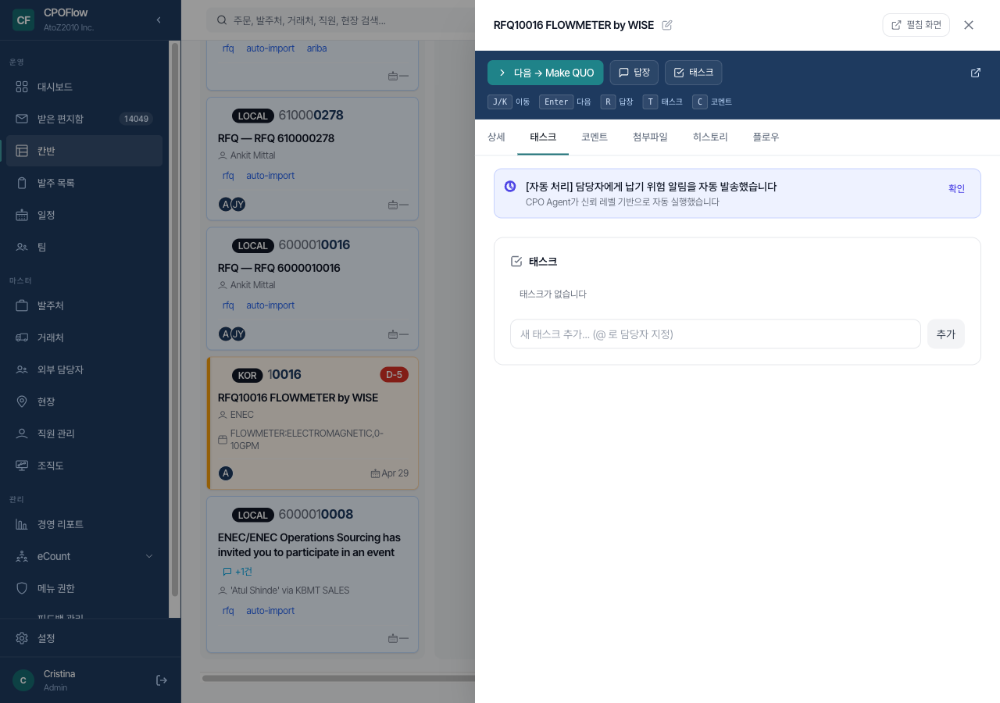

- 오더마다 **해야 할 세부 작업**을 체크리스트로 관리 (예: "KS인증 확인", "원가 계산", "납기 확답")
- `@담당자` 입력하면 팀원 지정 가능
- 체크하면 취소선 + 완료율 자동 계산

### 5-2. 코멘트 탭 — 팀 내 대화

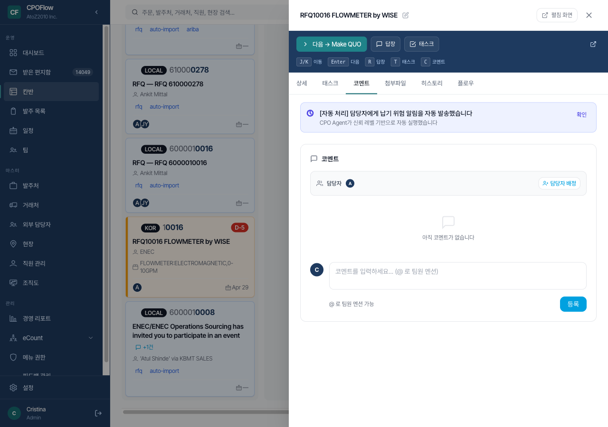

- 오더 하나하나마다 **전용 대화 공간**
- `@팀원` 멘션하면 그 사람에게 알림 발송
- **담당자 배정도 코멘트 탭에서 한 번에** 가능 — "담당자 배정" 버튼

### 5-3. 첨부파일 탭 — 견적서/PO/스펙 문서

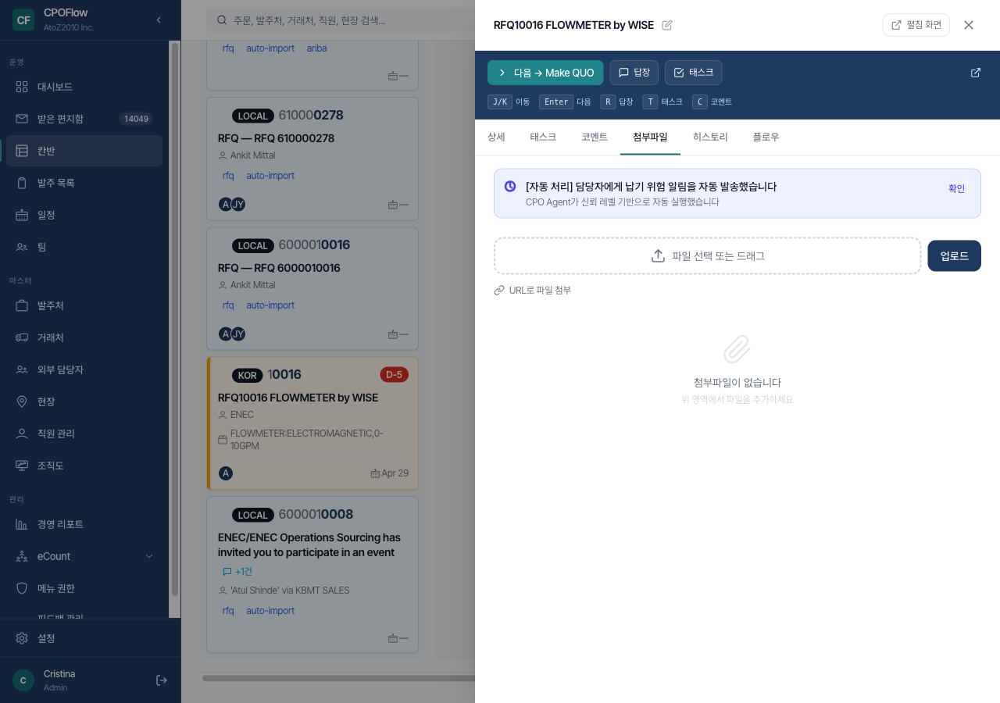

- **"파일 선택 또는 드래그"** — 드래그&드롭 지원
- **URL로 파일 첨부** — SAP Ariba 포털 링크도 자동 수집
- PDF/Excel/이미지는 **클릭 한 번에 미리보기** (다운로드 없이 바로 확인)
- 한 파일당 최대 50MB까지 허용

### 5-4. 히스토리 탭 — 누가 언제 무엇을 바꿨는지

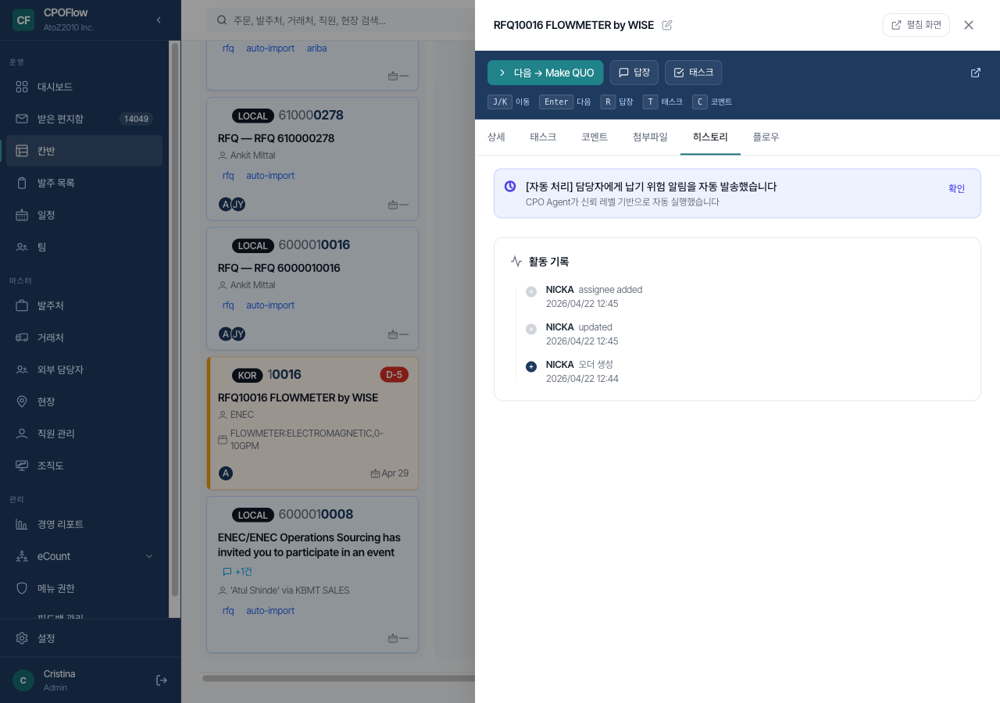

- 오더가 **언제 생성됐고, 누가 무엇을 수정했고, 언제 담당자가 배정됐는지** 시간 순서대로 기록
- 예: "NICKA assignee added — 2026/04/22 12:45"
- **감사(audit) 용도** + 문제 발생 시 **원인 추적** 가능

### 5-5. 플로우 탭 — 오더 관계도

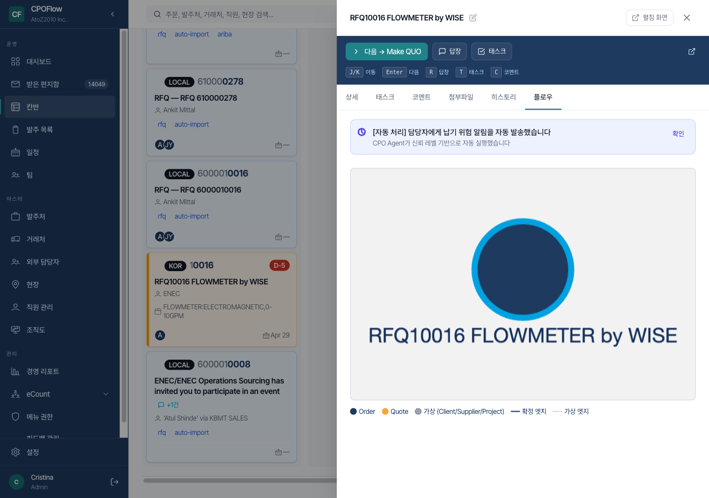

- 이 오더와 연결된 **견적·발주·납품·분리된 오더들을 한 장의 지도로** 시각화
- 큰 원(Order) ←→ 작은 원(Quote) ←→ 가상 노드(Client/Supplier/Project)
- 복잡한 조달 이력도 **그림 한 장으로 전체 구조 파악**

---

## 6. 받은편지함 — Gmail 자동 수집 + AI 분류

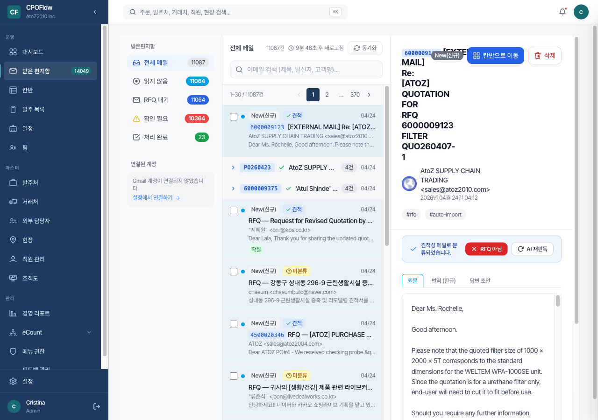

**좋아진 점**

1. **왼쪽 4개 필터** — 전체 메일 / 읽지 않음 / RFQ 대기 / 확인 필요 / 처리 완료

2. **중앙 메일 목록**
   - 각 메일에 **AI가 자동 분류한 태그**: 🟢"견적" / 🟡"미분류" / 🔴"RFQ 아님"
   - 관리번호(6000009123, PO260423)가 자동 추출되어 **발주번호 배지**로 표시
   - 중복 메일은 스레드로 그룹핑 ("4건 → " 펼치기)

3. **오른쪽 메일 상세**
   - 원문 / 번역(한글) / 답변 초안 3가지 탭
   - **AI가 자동 생성한 답변 초안** 제공 — 검토만 하고 발송
   - 하단 "✓ 견적성 메일로 분류되었습니다" / "✕ RFQ 아님" / "🔄 AI 재판독" 3개 액션

4. **"칸반으로 이동" 버튼** — 견적 가능한 메일은 원클릭으로 칸반 카드로 변환

→ **하루 수백 통의 견적 요청 메일을 AI가 1차 분류**해서, 사람은 검토만 하면 됩니다.

---

## 7. 경영 리포트 — 숫자로 보는 우리 회사

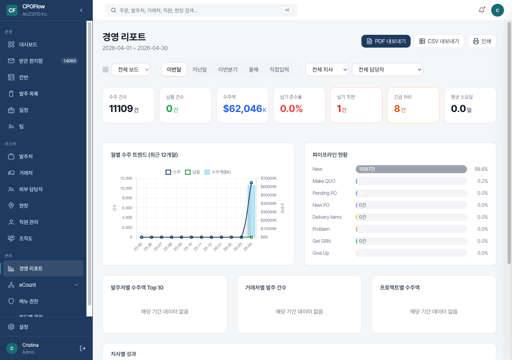

**좋아진 점**

### 7-1. 상단 7개 KPI 카드 (한 줄)
- 수주 건수 / 납품 건수 / 수주액 / 납기 준수율 / 납기 지연 / 긴급 처리 / 평균 소요일
- 기간(이번달/지난달/이번분기/올해/직접입력), 지사, 담당자별로 필터링

### 7-2. 월별 수주 트렌드 차트
- 최근 12개월 수주 / 납품 / 수주액 3축 그래프
- 4월만 치솟는 모양새가 한 눈에 — **월별 계절성 파악 용이**

### 7-3. 파이프라인 현황 (9단계 비율 바)
- 각 단계가 전체의 몇 %인지 **가로 막대 그래프** 로 한 눈에
- 지금은 New가 99.8% → "신규 오더가 많이 들어왔고 아직 Make QUO로 넘긴 게 0.2%뿐이구나" 즉각 해석

### 7-4. 발주처/거래처/프로젝트별 Top 10

### 7-5. 지사별 성과 비교

### 7-6. **PDF / CSV / 인쇄 내보내기** 우측 상단 3개 버튼
- 경영진 보고용 한 클릭

---

## 8. 발주처 관리 — 고객 정보를 체계적으로

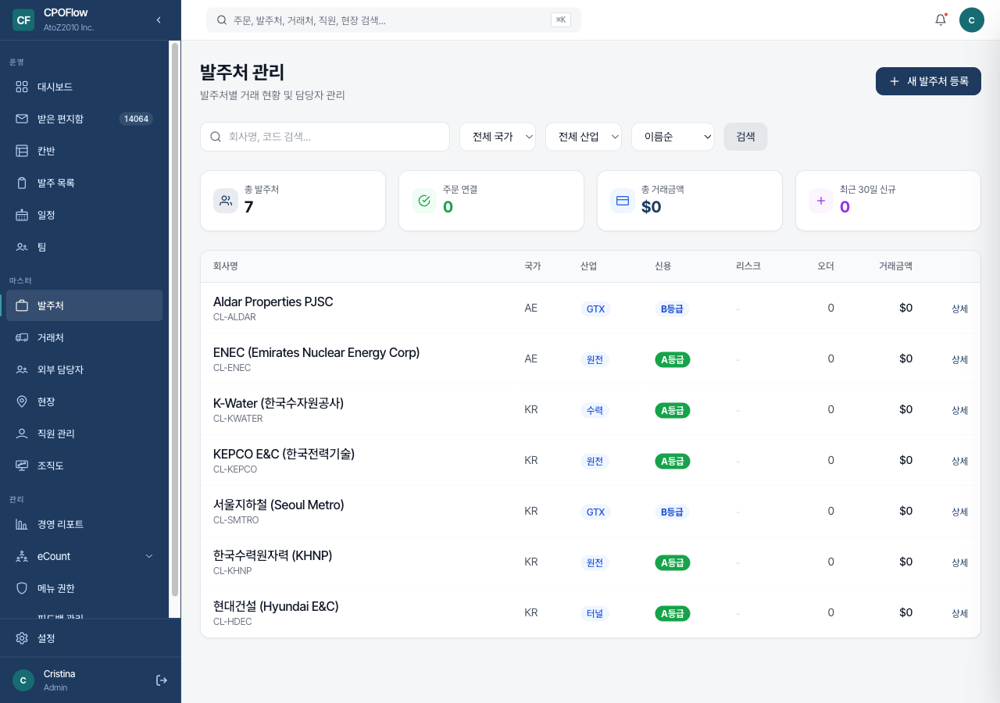

**좋아진 점**

1. **회사별 5개 필드 한 줄**: 회사명 / 국가 / 산업 / 신용등급 / 리스크
   - 신용등급 배지 (A등급/B등급) — 한 눈에 우량 여부 판단
   - 산업 태그 (GTX/원전/수력/터널) — 섹터별 분류

2. **상단 4개 KPI**: 총 발주처 / 주문 연결 / 총 거래금액 / 최근 30일 신규

3. **오른쪽 끝 "상세" 버튼** — 클릭하면 해당 발주처의 **담당자 · 프로젝트 · 오더 이력** 3개 탭 상세 화면

---

## 9. 발주 목록 — 전체 검색 + 필터

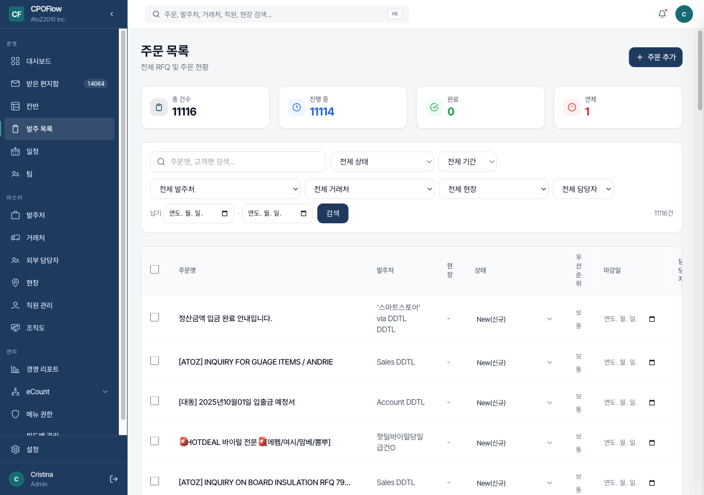

**좋아진 점**

1. **상단 4개 KPI 카드**: 총 건수 11,116 / 진행 중 11,114 / 완료 0 / 연체 1

2. **7가지 필터 필드 한 줄**: 주문명·고객명 검색 / 전체 상태 / 전체 기간 / 전체 발주처 / 전체 거래처 / 전체 현장 / 전체 담당자 + 납기 범위

3. **테이블 형태 전체 목록** — 드로어 대신 전체 화면으로 확인하고 싶을 때 사용

---

## 10. 일정(캘린더) — 납기를 달력 위에서 관리

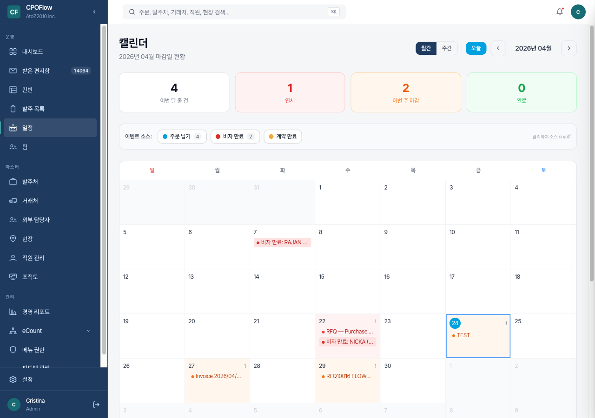

**좋아진 점**

1. **상단 4개 KPI**: 이번 달 총 건 4 / 연체 1 / 이번 주 마감 2 / 완료 0

2. **3종 이벤트를 한 달력에 합쳐 표시**
   - 🔵 주문 납기 4건
   - 🔴 비자 만료 2건 (직원 관리와 통합)
   - 🟡 계약 만료

3. **이벤트 소스 on/off 토글** — 원하는 종류만 선택해서 볼 수 있음

4. **날짜 클릭** → 해당 일자의 오더 드로어 즉시 열림

---

## 11. 개선 전 · 후 한눈 비교

| 항목 | 이전 | 이후 |
|---|---|---|
| **드로어 열고 "다음 행동"까지** | 3~5초 소요 (스크롤 필요) | 0.5초 (맨 위에 버튼) |
| **스테이지 전환 평균 시간** | 5초 | 1초 |
| **관리번호(RFQ/QUO/PO) 등록** | 별도 페이지 이동 15초 | 클릭 → 인라인 입력 3초 |
| **탭 탐색** | 빈 탭도 전부 클릭 | 건수 배지로 미리 확인 |
| **화면당 스크롤 횟수** | 3~4회 | 0~1회 |
| **잘못된 단계 이동** | 9단계 드롭다운 위험 | 허용 전이만 표시 (실수 차단) |
| **정보 밀도** | 수직 긴 나열 | 2열 그리드 압축 |
| **AI 지원** | 없음 | CPO Agent 자동 납기 위험 감지 |
| **연결된 거래 추적** | 불가 | 자동 족보 시각화 (플로우 탭) |
| **키보드 단축키** | 없음 | Enter/R/T/C 4개 (오더 간 이동 단축키는 다음 배포) |

---

## 12. 정리 — 기존 기능은 하나도 사라지지 않았습니다

개선의 핵심은 **없애기가 아니라 정리**였습니다.

| 기능 | 이전 → 이후 | 상태 |
|---|---|---|
| 고객사·마감일·품목·공급사·예상금액 | 그대로 | ✅ 보존 |
| RFQ/QUO/PO 관리번호 | 3개 → 색깔 분류 + 인라인 편집 | 🔼 강화 |
| 담당자 배정 | 단순 지정 → 전용 카드 + 코멘트 탭 배정 | 🔼 강화 |
| 스테이지 이동 | 드롭다운 → 허용 전이만 + 전체 보기 | 🔼 강화 |
| 설명·태그 | 작은 텍스트 → 탭 배지·필터 연동 | 🔼 강화 |
| 첨부파일 | 목록만 → 건수 배지 + 미리보기 + 드래그업로드 | 🔼 강화 |
| 히스토리 | 기존대로 | ✅ 보존 |
| **연결된 거래 추적** | 없음 | 🆕 신규 |
| **플로우 관계도** | 없음 | 🆕 신규 |
| **CPO Agent 자동 알림** | 없음 | 🆕 신규 |
| **키보드 단축키** (Enter/R/T/C) | 없음 | 🆕 신규 (오더 간 이동은 차기 배포) |

**제거된 기능: 0건**

---

## 13. 클라이언트 동의 요청

아래 10개 항목에 대해 의견 주시면 그 방향으로 배포를 진행하겠습니다.

### 개선안 유지에 동의하시나요?

- [ ] ① 상단 "다음 단계" 초록 버튼 유지 (화면 최상단 고정)
- [ ] ② 배지 4종 병렬 배치 (신규/팀/D-Day/이메일 출처)
- [ ] ③ 2열 그리드 핵심 정보 (고객사·마감일·품목·금액)
- [ ] ④ RFQ/QUO/PO 색깔 코드 + 클릭 인라인 편집
- [ ] ⑤ 탭에 건수 배지 표시 (태스크·코멘트·첨부파일 등)
- [ ] ⑥ 값 없는 필드 자동 숨김 (정보가 채워지면 자동 노출)
- [ ] ⑦ 스테이지 이동 시 허용 단계만 노출 (실수 방지)
- [ ] ⑧ 키보드 단축키 힌트 상시 노출
- [ ] ⑨ CPO Agent 자동 알림 배너
- [ ] ⑩ 연결된 거래 / 플로우 관계도 신규 탭

### 추가로 원하시는 기능 (자유 기입)

> 예시:
> - "공급사 담당자 WhatsApp 원클릭 연결도 넣어주세요"
> - "결제 조건(선수금 %) 필드가 필요합니다"
> - "관련 과거 오더의 단가 비교가 보였으면 좋겠어요"

(여기에 적어주세요)

---

## 14. 다음 단계

1. 본 문서 클라이언트 공유 → **동의 / 이의 체크**
2. 이의 제기된 항목만 **부분 조정** 후 재배포
3. 동의 받은 UI는 **최종 배포 (kamal deploy)**
4. 배포 후 1주간 **실사용 피드백** 수집
5. 피드백 기반 **2차 보완** 작업

---

**문의**: admin@atozone.com
**스크린샷 촬영 환경**: 배포 서버(https://cpoflow.ddtl.co.kr) / 관리자 계정 / 2026-04-24
**모든 스크린샷은 실제 운영 중인 오더 데이터로 촬영됨**
