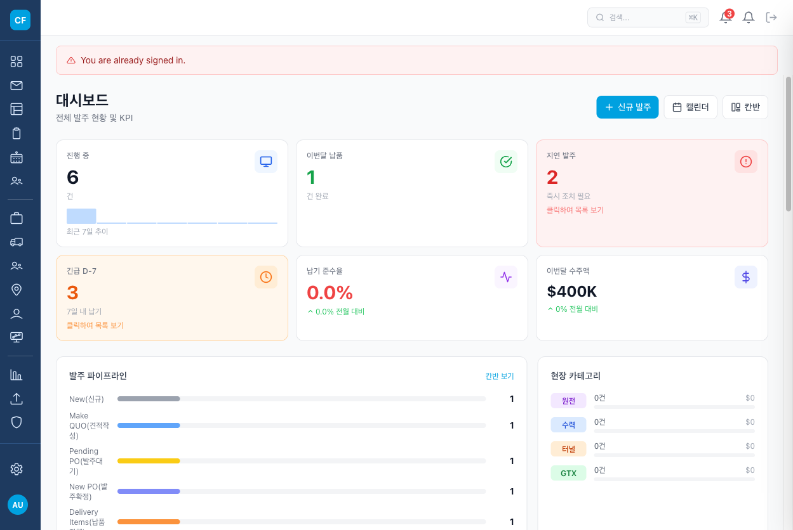
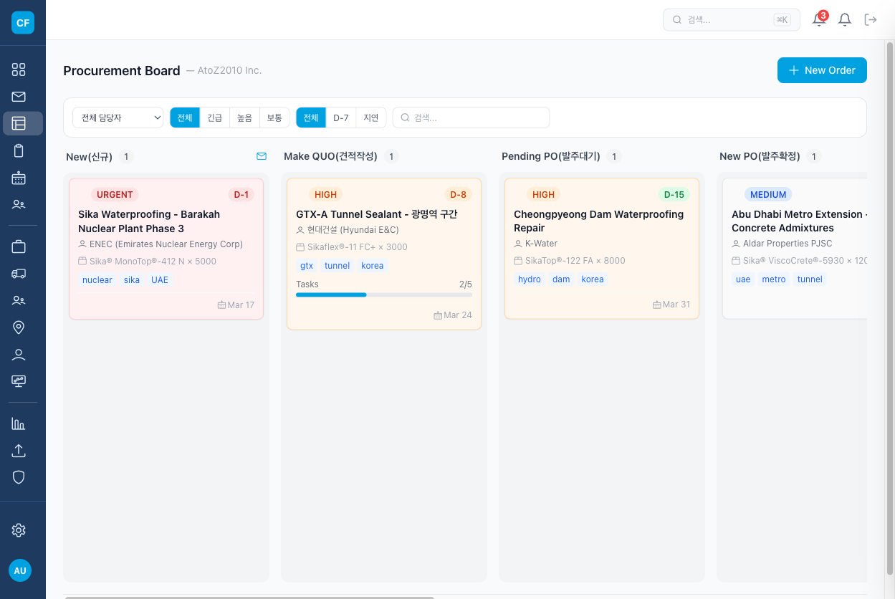
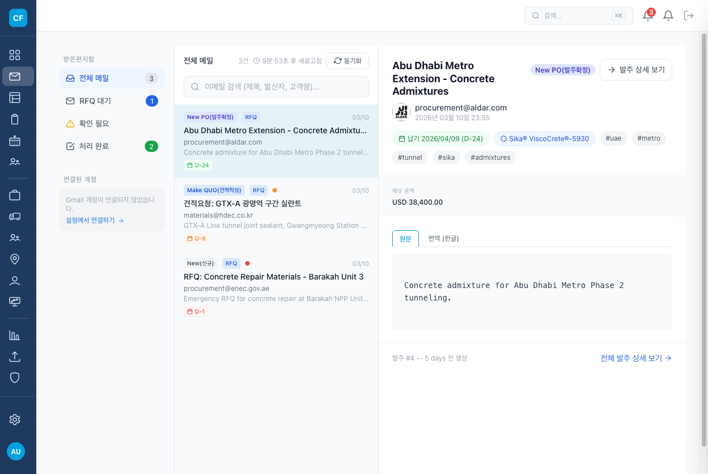
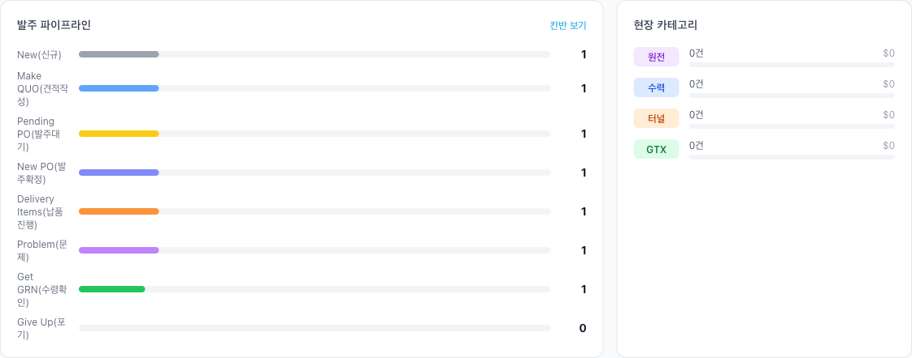

# CPOFlow 2026.03.13 회의 이슈 처리 보고서

**보고일**: 2026년 3월 16일
**작성**: Gagahoho, Inc. 개발팀
**대상**: AtoZ2010 Inc.

---

## 회의 안건 처리 현황

| # | 안건 | 상태 | 비고 |
|---|------|:----:|------|
| 1 | Inbox 메일 제목 간소화 | **계획 완료** | Plan 문서 작성, 구현 예정 |
| 2 | 칸반 보드 단계 이름 변경 (8단계) | **완료** | 100% Match Rate 달성 |
| 3 | 견적 품목 누락 방지 운영 방안 | 기획 완료 | 추후 구현 예정 |
| 4 | Inbox 메일 동기화 중단 원인 분석 | 기획 완료 | 모니터링 체계 설계 완료 |
| 5 | Inbox 페이지네이션 UI/UX 개선 | **완료** | 이전 세션에서 구현 완료 |

---

## 1. 칸반 보드 8단계 리네이밍 (완료)

### 변경 내용
기존 7단계 칸반을 업무 실무에 맞는 8단계로 전면 재구성했습니다.

| 기존 | 변경 후 | 표시 라벨 |
|------|---------|----------|
| inbox (0) | new_rfq (0) | New(신규) |
| reviewing (1) | make_quo (1) | Make QUO(견적작성) |
| quoted (2) | pending_po (2) | Pending PO(PO대기) |
| confirmed (3) | new_po (3) | New PO(신규발주) |
| procuring (4) | delivery_items (4) | Delivery Items(납품물품) |
| qa (5) | problem (5) | Problem(문제) |
| delivered (6) | get_grn (6) | Get GRN(수령확인) |
| *(신규)* | give_up (7) | Give Up(포기) |

### 영향 범위
- **변경 파일: 30개 이상** (모델, 컨트롤러, 뷰, 서비스, 시드 데이터)
- DB 마이그레이션 없이 Integer enum 매핑 유지로 안전하게 전환
- PDCA Gap Analysis: **100% Match Rate** 달성 (57개 항목 전체 통과)

### 결과 스크린샷

#### Dashboard - KPI 카드 + 파이프라인

*새로운 8단계 파이프라인이 대시보드에 반영된 모습*

#### 칸반 보드 - 8단계 전체 표시

*8개 칼럼(New, Make QUO, Pending PO, New PO, Delivery Items, Problem, Get GRN, Give Up) 전체 표시*

#### Inbox - 상태 배지 반영

*Inbox 목록에 새로운 상태 배지(New PO, Make QUO, New 등) 적용*

#### Dashboard 파이프라인 차트

*파이프라인 바 차트에 Give Up(포기) 포함 8단계 모두 표시*

---

## 2. Inbox 메일 제목 간소화 (계획 완료)

### 문제점
견적업무 특성상 동일 건에 대해 RE:/FW: 접두사가 반복 누적되어 Inbox 가독성 저하:
```
RE: RE: RE: FW: RFQ 6000009324 - Bosch Power Tools Set GBH 2-26 - 3rd Reminder
```

### 해결 방안 (구현 예정)
- `display_subject` 메서드: RE/FW 접두사 제거 + 견적번호 배지 분리
- `subject_tags` 메서드: Reminder/Revised/Urgent 등 상태 키워드 태그 추출

**간소화 예시:**
```
Before: RE: RE: FW: RFQ 6000009324 - Bosch Power Tools Set GBH 2-26 - 3rd Reminder
After:  [6000009324]  Bosch Power Tools Set GBH 2-26  [Reminder]
```

- DB 변경 없음 (런타임 계산)
- 원본 제목(`original_email_subject`)은 그대로 보존

---

## 3. 견적 품목 누락 방지 (기획 완료)

### 문제 사례
메일 제목에는 "전동공구(Power Tools)"만 기재, 본문에는 정확한 세트 넘버가 명시 → 작업자가 제목만 보고 단품 발주하여 세트 구성품 누락

### 기획된 해결책
1. **AI 품목 추출 강화**: 본문에서 모델번호/세트번호/파트넘버 추가 추출
2. **불일치 경고**: 제목 품목과 본문 품번 상이 시 경고 배지 표시
3. **체크리스트**: Make QUO 단계 진입 시 확인 체크리스트 자동 생성

---

## 4. 메일 동기화 중단 원인 분석 (기획 완료)

### 현상
2026.03.13 시점 Inbox에 3/7(금)까지의 이메일만 표시 (약 6일간 동기화 중단)

### 기획된 재발 방지 체계
1. **동기화 모니터링 대시보드**: 마지막 동기화 시각 + 건수 표시
2. **24시간 미동기화 알림**: Admin에 자동 알림
3. **Heartbeat 체크**: 별도 `SyncHealthCheckJob`으로 30분 이상 미실행 감지
4. **자동 복구**: 실패 감지 시 자동 백필 트리거

---

## 5. 페이지네이션 UI 개선 (완료)

### 변경 내용
기존 이전/다음 화살표만 제공하던 페이지네이션을 **페이지 번호 직접 클릭** 방식으로 개선:

```
Before:  1-30 / 327건              < 4 / 11 >
After:   91-120 / 327건    < 1 2 3 [4] 5 ... 11 >
```

- PER_PAGE = 30 유지 (UAE 네트워크 환경 고려)
- gzip 압축 적용 유지
- 필터/검색 파라미터 유지하며 페이지 전환

---

## 향후 일정

| 우선순위 | 항목 | 예상 난이도 |
|---------|------|-----------|
| 1 | Inbox 메일 제목 간소화 구현 | 중 |
| 2 | 메일 동기화 모니터링 체계 구축 | 중 |
| 3 | 견적 품목 누락 방지 (불일치 경고) | 상 |

---

*본 보고서는 2026.03.13 회의 안건에 대한 처리 현황을 정리한 것입니다.*
