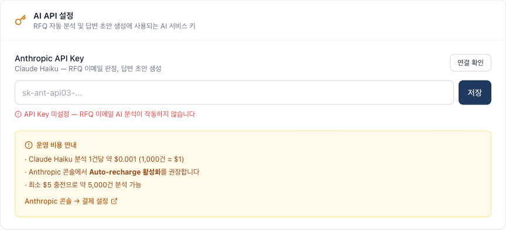
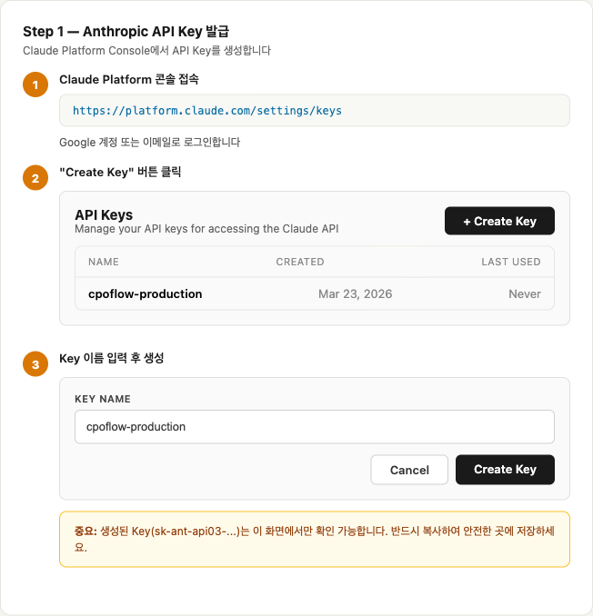
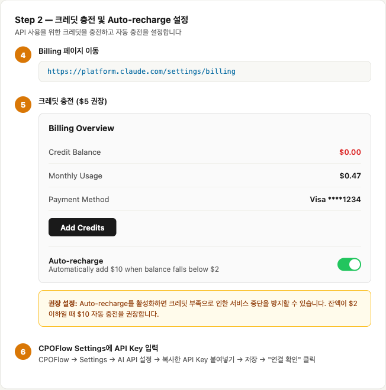

# CPOFlow 이메일 동기화 이슈 보고 및 개선 안내

**일자:** 2026년 3월 23일
**작성:** CPOFlow 개발팀
**대상:** AtoZ2010 Inc. 관리자

---

## 1. 현상

2026년 3월 7일 이후, CPOFlow에 동기화된 이메일이 **총 9건**에 불과한 것이 확인되었습니다. 해당 기간 동안 실제 수신된 이메일은 하루 평균 약 20건으로, 정상적이라면 약 300건 이상이 시스템에 등록되어야 합니다.

## 2. 원인 분석

CPOFlow의 이메일 분류 시스템은 **2단계 구조**로 작동합니다:

| 단계 | 방식 | 역할 |
|------|------|------|
| 1단계 | 키워드 기반 규칙 | 이메일 제목/본문에서 RFQ 관련 키워드 매칭 |
| 2단계 | AI 분석 (Claude Haiku) | 1단계에서 판별이 애매한 이메일을 AI가 정밀 분석 |

**근본 원인:** 2단계 AI 분석에 사용되는 **Anthropic API 크레딧이 소진**되어, AI 분석이 필요한 이메일이 모두 **"분석 불가 → 비RFQ"로 잘못 분류**되었습니다.

```
정상 흐름:   이메일 수신 → 키워드 1차 판정 → AI 2차 정밀 분석 → 분류 완료
장애 흐름:   이메일 수신 → 키워드 1차 판정 → AI 호출 실패(크레딧 부족) → 비RFQ로 분류 ❌
```

이로 인해 다음과 같은 비즈니스 이메일들이 누락되었습니다:
- PO Confirmation Reminder (발주 확인 리마인더)
- Delivery Information (배송 정보)
- Purchase Order (발주서)
- Inquiry / Clarification (문의/확인 요청)

## 3. 조치 완료 사항

### 3.1 AI 장애 시 안전장치 추가 (Fallback)

AI 분석이 불가능한 상황에서도 이메일이 누락되지 않도록 **키워드 기반 판정 Fallback**을 추가하였습니다.

| 상황 | 기존 동작 | 개선 후 |
|------|-----------|---------|
| AI 정상 | 키워드(40%) + AI(60%) 종합 판정 | 변경 없음 |
| AI 장애 | **비RFQ 처리 (누락)** | **키워드만으로 판정 → Inbox에 표시** |

이제 AI 크레딧이 부족하더라도 키워드 매칭이 조금이라도 되는 이메일은 "확인 필요(Uncertain)" 상태로 Inbox에 표시됩니다.

### 3.2 Settings 페이지에 API Key 관리 기능 추가

관리자가 직접 AI 서비스 상태를 확인하고 관리할 수 있도록 **Settings → AI API 설정** 섹션을 추가하였습니다.



- **API Key 입력 및 저장** — Anthropic API Key를 직접 입력하여 관리
- **"연결 확인" 버튼** — 클릭 한 번으로 API 연결 상태 및 크레딧 잔액 확인
- **운영 비용 안내** — 분석 건당 비용, 자동 충전 권장 사항 표시
- **Anthropic 콘솔 바로가기** — 결제 설정 페이지로 직접 이동 링크

## 4. 필요한 조치 (관리자 액션)

### 4.1 Anthropic API Key 발급 (신규 사용자)

아직 API Key가 없는 경우, 아래 절차에 따라 발급받으세요.



1. **Claude Platform 콘솔 접속:** https://platform.claude.com/settings/keys
2. Google 계정 또는 이메일로 로그인
3. **"Create Key"** 버튼 클릭
4. Key 이름 입력 (예: `cpoflow-production`) → **Create Key**
5. 생성된 Key(`sk-ant-api03-...`)를 **반드시 복사하여 안전한 곳에 저장**

> **주의:** 생성된 Key는 이 화면에서만 확인 가능합니다. 페이지를 벗어나면 다시 볼 수 없습니다.

### 4.2 크레딧 충전 및 Auto-recharge 설정 (필수)

AI 이메일 분석 기능을 정상화하려면 Anthropic API 크레딧 충전이 필요합니다.



1. **Billing 페이지 접속:** https://platform.claude.com/settings/billing
2. **"Add Credits"** 클릭 → 최소 **$5** 충전 권장 (약 5,000건 분석 가능)
3. **Auto-recharge 활성화 (강력 권장)**
   - 잔액이 $2 이하로 떨어지면 $10 자동 충전
   - 크레딧 부족으로 인한 서비스 중단 방지

> **비용 참고:** Claude Haiku 모델 기준, 이메일 1건 분석 비용은 약 **$0.001** (1,000건 ≈ $1)입니다. 월 500건 기준 **월 $0.5 미만**의 비용이 발생합니다.

### 4.3 CPOFlow Settings에 API Key 입력


1. CPOFlow → **Settings** → **AI API 설정** 섹션으로 이동
2. 발급받은 API Key(`sk-ant-api03-...`) 입력 → **저장**
3. **"연결 확인"** 버튼 클릭 → "API 연결 정상 — 크레딧 사용 가능" 메시지 확인

### 4.4 누락된 이메일 복구 (충전 후 자동)

크레딧 충전 후 다음 15분 동기화 주기에 자동으로 신규 이메일이 수집됩니다.
과거 누락분의 즉시 복구가 필요한 경우, 개발팀에 요청해 주시면 백필(Backfill) 작업을 진행하겠습니다.

## 5. 운영 비용 안내

CPOFlow AI 기능의 운영 비용은 **개발 비용과 별도**로 관리됩니다.

| 항목 | 비용 | 비고 |
|------|------|------|
| 이메일 AI 분석 (RFQ 판정) | ~$0.001/건 | Claude Haiku |
| 답변 초안 생성 | ~$0.002/건 | Claude Haiku |
| 월 예상 비용 (500건 기준) | **~$1.5** | |

AI 서비스 사용에 따른 API 비용은 서비스를 이용하는 조직에서 부담하며, Auto-recharge 설정으로 서비스 중단 없이 안정적으로 운영할 수 있습니다.

## 6. 재발 방지

| 조치 | 상태 |
|------|------|
| AI 장애 시 Fallback 판정 로직 | ✅ 적용 완료 |
| Settings에 API 상태 확인 기능 | ✅ 적용 완료 |
| Auto-recharge 설정 안내 | ✅ 본 문서에 포함 |
| 크레딧 부족 시 관리자 알림 (향후) | 🔲 계획 중 |

---

**문의 사항이 있으시면 개발팀으로 연락해 주시기 바랍니다.**
